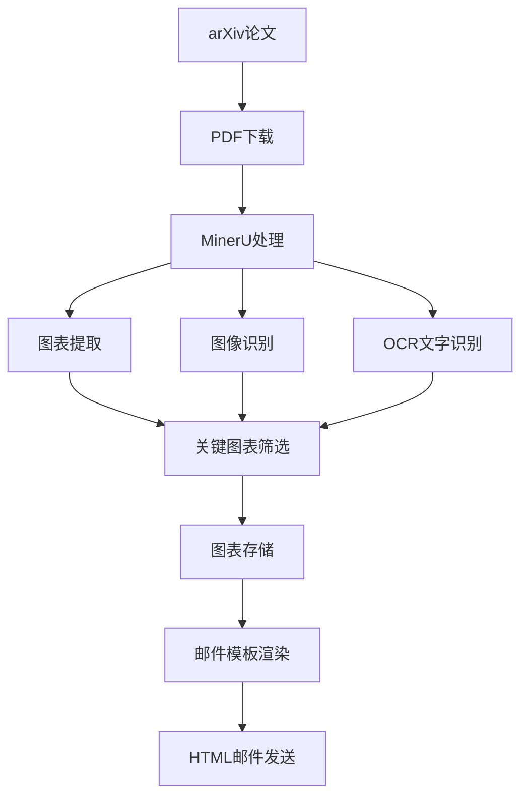

# MinerU多模态图表提取集成方案

## 概述

本方案描述了如何将MinerU多模态模型集成到Zotero-arXiv-Daily论文推荐系统中，用于从推荐论文的PDF中提取关键图表，并将这些图表嵌入到推荐邮件中，提升邮件的信息丰富度和用户体验。

## MinerU简介

MinerU是一个开源的PDF文档多模态内容提取工具，具备以下核心功能：

- **图表提取**：智能识别并提取PDF中的各种图表（柱状图、折线图、饼图、散点图等）
- **图像识别**：高质量提取PDF中的图像和插图
- **表格提取**：结构化提取表格数据
- **OCR功能**：对图表中的文字进行光学字符识别
- **多语言支持**：支持中英文等多种语言
- **API接口**：提供RESTful API，便于集成

## 集成架构设计

### 1. 架构概览



### 2. 模块设计

#### 2.1 MinerU集成模块 (`mineru_integration.py`)

负责与MinerU API交互，处理PDF文件并提取图表内容。

**主要功能：**
- PDF文件上传和处理
- 图表类型识别和分类
- 图表重要性评分
- 结果缓存机制

#### 2.2 图表管理模块 (`chart_manager.py`)

管理提取的图表数据，包括存储、检索和清理。

**主要功能：**
- 图表元数据管理
- 本地存储策略
- 图表质量控制
- 存储空间管理

#### 2.3 邮件模板扩展 (`construct_email.py`扩展示例)

扩展现有的邮件模板，支持图表内容的展示。

**主要功能：**
- 响应式图表展示
- 图表说明文字生成
- 多图表布局管理
- 附件优化

## 技术实现方案

### 1. 环境配置

#### 1.1 依赖添加

在 `pyproject.toml` 中添加MinerU相关依赖：

```toml
[project]
dependencies = [
    # 现有依赖...
    "mineru>=0.1.0",  # MinerU Python SDK
    "pillow>=10.0.0",  # 图像处理
    "base64",  # 图片编码
    "asyncio",  # 异步处理
]
```

#### 1.2 环境变量

在 `.env.example` 和GitHub Actions中添加MinerU配置：

```bash
# MinerU配置
MINERU_API_URL=https://api.mineru.com/v1
MINERU_API_KEY=your_mineru_api_key
MINERU_TIMEOUT=60
MINERU_MAX_CHARTS_PER_PAPER=3
MINERU_CHART_QUALITY_THRESHOLD=0.7
MINERU_CACHE_DURATION=86400  # 24小时缓存
```

### 2. 核心代码实现

#### 2.1 MinerU集成模块

```python
# mineru_integration.py
import os
import base64
import asyncio
import aiohttp
import aiofiles
from typing import List, Dict, Optional, Tuple
from dataclasses import dataclass
from enum import Enum
from loguru import logger
from PIL import Image
import io
import hashlib
import json
import time

class ChartType(Enum):
    BAR_CHART = "bar_chart"
    LINE_CHART = "line_chart"
    PIE_CHART = "pie_chart"
    SCATTER_PLOT = "scatter_plot"
    TABLE = "table"
    DIAGRAM = "diagram"
    UNKNOWN = "unknown"

@dataclass
class ExtractedChart:
    chart_type: ChartType
    image_base64: str
    confidence: float
    title: Optional[str] = None
    description: Optional[str] = None
    page_number: Optional[int] = None
    bbox: Optional[Tuple[int, int, int, int]] = None

class MinerUIntegrator:
    def __init__(self):
        self.api_url = os.getenv('MINERU_API_URL', 'https://api.mineru.com/v1')
        self.api_key = os.getenv('MINERU_API_KEY')
        self.timeout = int(os.getenv('MINERU_TIMEOUT', '60'))
        self.max_charts = int(os.getenv('MINERU_MAX_CHARTS_PER_PAPER', '3'))
        self.quality_threshold = float(os.getenv('MINERU_CHART_QUALITY_THRESHOLD', '0.7'))
        self.cache_dir = "cache/charts"

        # 创建缓存目录
        os.makedirs(self.cache_dir, exist_ok=True)

    def _get_cache_path(self, pdf_url: str) -> str:
        """获取缓存文件路径"""
        pdf_hash = hashlib.md5(pdf_url.encode()).hexdigest()
        return os.path.join(self.cache_dir, f"{pdf_hash}.json")

    def _is_cache_valid(self, cache_path: str) -> bool:
        """检查缓存是否有效"""
        if not os.path.exists(cache_path):
            return False

        cache_duration = int(os.getenv('MINERU_CACHE_DURATION', '86400'))  # 24小时
        file_age = time.time() - os.path.getmtime(cache_path)
        return file_age < cache_duration

    async def extract_charts_from_pdf(self, pdf_url: str, pdf_content: bytes) -> List[ExtractedChart]:
        """从PDF中提取图表"""
        # 检查缓存
        cache_path = self._get_cache_path(pdf_url)
        if self._is_cache_valid(cache_path):
            logger.info(f"Loading cached charts for {pdf_url}")
            return await self._load_cached_charts(cache_path)

        try:
            charts = await self._call_mineru_api(pdf_content)

            # 按置信度筛选
            filtered_charts = [
                chart for chart in charts
                if chart.confidence >= self.quality_threshold
            ]

            # 限制图表数量
            filtered_charts = filtered_charts[:self.max_charts]

            # 缓存结果
            await self._cache_charts(cache_path, filtered_charts)

            return filtered_charts

        except Exception as e:
            logger.error(f"Failed to extract charts from {pdf_url}: {e}")
            return []

    async def _call_mineru_api(self, pdf_content: bytes) -> List[ExtractedChart]:
        """调用MinerU API进行图表提取"""
        headers = {
            'Authorization': f'Bearer {self.api_key}',
            'Content-Type': 'application/pdf'
        }

        async with aiohttp.ClientSession(timeout=aiohttp.ClientTimeout(total=self.timeout)) as session:
            async with session.post(
                f"{self.api_url}/extract/charts",
                data=pdf_content,
                headers=headers
            ) as response:

                if response.status != 200:
                    error_text = await response.text()
                    raise Exception(f"MinerU API error: {response.status} - {error_text}")

                result = await response.json()
                return self._parse_mineru_response(result)

    def _parse_mineru_response(self, response: Dict) -> List[ExtractedChart]:
        """解析MinerU API响应"""
        charts = []

        for item in response.get('charts', []):
            try:
                chart = ExtractedChart(
                    chart_type=ChartType(item.get('type', 'unknown')),
                    image_base64=item.get('image', ''),
                    confidence=float(item.get('confidence', 0.0)),
                    title=item.get('title'),
                    description=item.get('description'),
                    page_number=item.get('page_number'),
                    bbox=tuple(item.get('bbox', [])) if item.get('bbox') else None
                )
                charts.append(chart)
            except Exception as e:
                logger.warning(f"Failed to parse chart item: {e}")
                continue

        return charts

    async def _load_cached_charts(self, cache_path: str) -> List[ExtractedChart]:
        """加载缓存的图表数据"""
        try:
            async with aiofiles.open(cache_path, 'r') as f:
                data = json.loads(await f.read())

            charts = []
            for chart_data in data:
                chart = ExtractedChart(
                    chart_type=ChartType(chart_data['chart_type']),
                    image_base64=chart_data['image_base64'],
                    confidence=chart_data['confidence'],
                    title=chart_data.get('title'),
                    description=chart_data.get('description'),
                    page_number=chart_data.get('page_number'),
                    bbox=tuple(chart_data['bbox']) if chart_data.get('bbox') else None
                )
                charts.append(chart)

            return charts
        except Exception as e:
            logger.error(f"Failed to load cached charts: {e}")
            return []

    async def _cache_charts(self, cache_path: str, charts: List[ExtractedChart]):
        """缓存图表数据"""
        try:
            data = []
            for chart in charts:
                chart_dict = {
                    'chart_type': chart.chart_type.value,
                    'image_base64': chart.image_base64,
                    'confidence': chart.confidence,
                    'title': chart.title,
                    'description': chart.description,
                    'page_number': chart.page_number,
                    'bbox': list(chart.bbox) if chart.bbox else None
                }
                data.append(chart_dict)

            async with aiofiles.open(cache_path, 'w') as f:
                await f.write(json.dumps(data, indent=2))

        except Exception as e:
            logger.error(f"Failed to cache charts: {e}")

# 全局MinerU集成器实例
GLOBAL_MINERU = MinerUIntegrator()
```

#### 2.2 ArxivPaper类扩展

```python
# paper.py 扩展
from typing import Optional, List
from mineru_integration import GLOBAL_MINERU, ExtractedChart
import aiohttp
import asyncio

class ArxivPaper:
    # ... 现有代码 ...

    @cached_property
    async def charts(self) -> List[ExtractedChart]:
        """异步获取论文中的图表"""
        try:
            # 下载PDF内容
            async with aiohttp.ClientSession() as session:
                async with session.get(self.pdf_url) as response:
                    if response.status == 200:
                        pdf_content = await response.read()
                        return await GLOBAL_MINERU.extract_charts_from_pdf(
                            self.pdf_url, pdf_content
                        )
                    else:
                        logger.warning(f"Failed to download PDF for {self.arxiv_id}: {response.status}")
                        return []
        except Exception as e:
            logger.error(f"Error extracting charts from {self.arxiv_id}: {e}")
            return []

    @cached_property
    async def important_charts(self) -> List[ExtractedChart]:
        """获取重要图表（按置信度排序）"""
        charts = await self.charts
        return sorted(charts, key=lambda x: x.confidence, reverse=True)
```

#### 2.3 邮件模板扩展

```python
# construct_email.py 扩展
def get_chart_html(chart) -> str:
    """生成单个图表的HTML"""
    chart_type_icons = {
        "bar_chart": "📊",
        "line_chart": "📈",
        "pie_chart": "🥧",
        "scatter_plot": "⚡",
        "table": "📋",
        "diagram": "🎯"
    }

    icon = chart_type_icons.get(chart.chart_type.value, "📊")

    chart_html = f"""
    <div style="margin: 12px 0; padding: 16px; border: 1px solid #e0e0e0; border-radius: 8px; background-color: #fafafa;">
        <div style="display: flex; align-items: center; margin-bottom: 8px;">
            <span style="font-size: 18px; margin-right: 8px;">{icon}</span>
            <span style="font-weight: bold; color: #333;">{chart.title or 'Important Chart'}</span>
            <span style="margin-left: auto; font-size: 12px; color: #666;">
                Confidence: {chart.confidence:.2f}
            </span>
        </div>

        <div style="text-align: center; margin: 8px 0;">
            
        </div>

        {f'<div style="font-size: 14px; color: #555; margin-top: 8px; font-style: italic;">{chart.description}</div>' if chart.description else ''}
    </div>
    """
    return chart_html

def get_block_html_with_charts(title:str, authors:str, rate:str, arxiv_id:str, abstract:str,
                              pdf_url:str, code_url:str=None, affiliations:str=None, charts=None):
    """扩展的邮件模板，包含图表"""
    code = f'<a href="{code_url}" style="display: inline-block; text-decoration: none; font-size: 14px; font-weight: bold; color: #fff; background-color: #5bc0de; padding: 8px 16px; border-radius: 4px; margin-left: 8px;">Code</a>' if code_url else ''

    # 生成图表HTML
    charts_html = ""
    if charts and len(charts) > 0:
        charts_html = f"""
        <tr>
            <td style="font-size: 16px; font-weight: bold; color: #333; padding: 12px 0 8px 0;">
                📊 Key Charts & Visualizations
            </td>
        </tr>
        <tr>
            <td style="padding: 8px 0;">
                {''.join([get_chart_html(chart) for chart in charts])}
            </td>
        </tr>
        """

    block_template = f"""
    <table border="0" cellpadding="0" cellspacing="0" width="100%" style="font-family: Arial, sans-serif; border: 1px solid #ddd; border-radius: 8px; padding: 16px; background-color: #f9f9f9; margin-bottom: 24px;">
    <tr>
        <td style="font-size: 20px; font-weight: bold; color: #333;">
            {title}
        </td>
    </tr>
    <tr>
        <td style="font-size: 14px; color: #666; padding: 8px 0;">
            {authors}
            <br>
            <i>{affiliations}</i>
        </td>
    </tr>
    <tr>
        <td style="font-size: 14px; color: #333; padding: 8px 0;">
            <strong>Relevance:</strong> {rate}
        </td>
    </tr>
    <tr>
        <td style="font-size: 14px; color: #333; padding: 8px 0;">
            <strong>arXiv ID:</strong> <a href="https://arxiv.org/abs/{arxiv_id}" target="_blank">{arxiv_id}</a>
        </td>
    </tr>
    <tr>
        <td style="font-size: 14px; color: #333; padding: 8px 0;">
            <strong>TLDR:</strong> {abstract}
        </td>
    </tr>
    {charts_html}
    <tr>
        <td style="padding: 12px 0;">
            <a href="{pdf_url}" style="display: inline-block; text-decoration: none; font-size: 14px; font-weight: bold; color: #fff; background-color: #d9534f; padding: 8px 16px; border-radius: 4px;">PDF</a>
            {code}
        </td>
    </tr>
    </table>
    """
    return block_template

async def render_email_with_charts(papers: list[ArxivPaper]):
    """渲染包含图表的邮件"""
    parts = []

    if len(papers) == 0:
        return framework.replace('__CONTENT__', get_empty_html())

    for p in tqdm(papers, desc='Rendering Email with Charts'):
        try:
            # 并发获取图表和TLDR
            charts_task = asyncio.create_task(p.charts)
            tldr_task = asyncio.create_task(asyncio.to_thread(lambda: p.tldr))

            charts, tldr = await asyncio.gather(charts_task, tldr_task)

            rate = get_stars(p.score)
            author_list = [a.name for a in p.authors]
            num_authors = len(author_list)

            if num_authors <= 5:
                authors = ', '.join(author_list)
            else:
                authors = ', '.join(author_list[:3] + ['...'] + author_list[-2:])

            affiliations = 'Unknown Affiliation'  # 保持现有逻辑
            code_url = None  # 保持现有逻辑

            parts.append(get_block_html_with_charts(
                p.title, authors, rate, p.arxiv_id, tldr,
                p.pdf_url, code_url, affiliations, charts
            ))

            time.sleep(2)  # 保持现有的延迟

        except Exception as e:
            logger.error(f"Error rendering email for {p.arxiv_id}: {e}")
            # 如果图表提取失败，使用原始模板
            parts.append(get_block_html(
                p.title, authors, rate, p.arxiv_id, p.tldr,
                p.pdf_url, code_url, affiliations
            ))

    content = '<br>' + '</br><br>'.join(parts) + '</br>'
    return framework.replace('__CONTENT__', content)
```

### 3. 主程序修改

```python
# main.py 修改
import asyncio
from construct_email import render_email_with_charts

# 在main函数中替换邮件渲染逻辑
if __name__ == '__main__':
    # ... 现有代码 ...

    # 异步渲染邮件
    async def render_and_send():
        html = await render_email_with_charts(papers)
        logger.info("Sending email...")
        send_email(args.sender, args.receiver, args.sender_password,
                  args.smtp_server, args.smtp_port, html)
        logger.success("Email sent successfully!")

    # 运行异步任务
    asyncio.run(render_and_send())
```

## 性能优化策略

### 1. 缓存策略
- **PDF缓存**：缓存下载的PDF文件，避免重复下载
- **图表缓存**：缓存提取的图表结果，设置合理的过期时间
- **API调用限制**：控制对MinerU API的调用频率，避免触发限制

### 2. 并发处理
- **异步下载**：并发下载多个PDF文件
- **批量处理**：将多个论文的图表提取请求批量发送
- **超时控制**：设置合理的超时时间，避免长时间等待

### 3. 质量控制
- **置信度筛选**：只保留高置信度的图表
- **图表去重**：避免显示相似的图表
- **数量限制**：限制每篇论文显示的图表数量

## 部署和配置

### 1. GitHub Actions配置

在 `.github/workflows/main.yml` 中添加MinerU环境变量：

```yaml
env:
  # 现有环境变量...
  MINERU_API_KEY: ${{ secrets.MINERU_API_KEY }}
  MINERU_API_URL: https://api.mineru.com/v1
  MINERU_TIMEOUT: 60
  MINERU_MAX_CHARTS_PER_PAPER: 3
  MINERU_CHART_QUALITY_THRESHOLD: 0.7
```

### 2. 本地开发配置

创建本地 `.env` 文件：

```bash
# MinerU配置（本地开发时使用）
MINERU_API_KEY=your_local_mineru_key
MINERU_API_URL=http://localhost:8000/v1  # 本地MinerU服务
MINERU_TIMEOUT=120  # 本地开发时可以设置更长超时
```

## 错误处理和监控

### 1. 错误处理策略
- **API失败回退**：MinerU API失败时回退到原始邮件模板
- **超时处理**：设置合理的超时时间，避免阻塞整个流程
- **日志记录**：详细记录图表提取过程中的错误和警告

### 2. 监控指标
- **图表提取成功率**：监控成功提取图表的论文比例
- **API响应时间**：监控MinerU API的响应性能
- **邮件大小**：监控包含图表的邮件大小，避免超过邮件服务商限制

## 成本分析

### 1. API成本
- **调用费用**：根据MinerU API的定价模型计算
- **存储成本**：图表缓存的存储空间需求
- **带宽成本**：包含图表的邮件传输带宽

### 2. 时间成本
- **处理延迟**：图表提取增加的处理时间
- **用户体验**：邮件大小增加可能影响加载速度

## 风险评估和缓解

### 1. 技术风险
- **API依赖性**：依赖第三方服务，需要制定降级策略
- **准确性风险**：图表提取可能不准确，需要人工审核机制
- **性能风险**：大量并发请求可能影响系统性能

### 2. 缓解措施
- **服务降级**：API失败时自动回退到基础功能
- **质量控制**：设置高置信度阈值，确保提取质量
- **资源限制**：限制并发请求数量，保护系统稳定性

## 测试策略

### 1. 单元测试
- **图表提取模块测试**：验证MinerU集成的正确性
- **邮件模板测试**：验证HTML渲染的正确性
- **缓存机制测试**：验证缓存功能的正确性

### 2. 集成测试
- **端到端测试**：完整测试从论文获取到邮件发送的流程
- **性能测试**：测试大量论文时的系统性能
- **错误场景测试**：测试各种错误情况的处理

## 总结

本方案提供了一个完整的MinerU多模态图表提取集成方案，具有以下优势：

1. **增强用户体验**：通过可视化图表提供更丰富的论文信息
2. **智能内容提取**：利用AI技术自动识别和提取重要图表
3. **高度可配置**：支持多种配置选项，适应不同需求
4. **性能优化**：通过缓存和并发处理保证系统性能
5. **错误容错**：完善的错误处理和降级机制

通过实施这个方案，Zotero-arXiv-Daily系统将能够为用户提供包含关键图表的丰富邮件内容，大大提升论文推荐的实用性和用户体验。